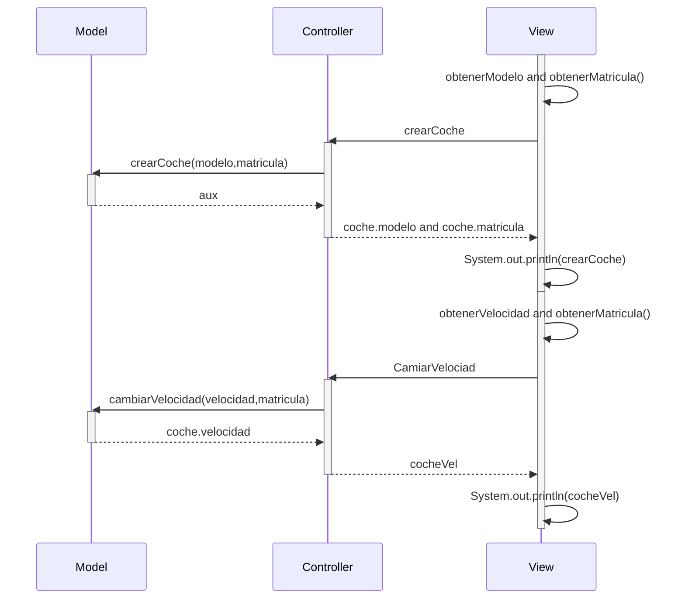

```mermaid
sequenceDiagram
    participant Model
    participant Controller
    participant View
    
    activate View
    View->>View:obtenerModelo and obtenerMatricula()
    View->>Controller:crearCoche
    activate Controller
    Controller->>Model:crearCoche(modelo,matricula)
    activate Model
    Model-->> Controller:aux
    deactivate Model
    Controller-->>View:coche.modelo and coche.matricula
    deactivate Controller
    View->>View:System.out.println(crearCoche)
    deactivate View
    activate View
    View->>View:obtenerVelocidad and obtenerMatricula()
    View->>Controller:CamiarVelociad
    activate Controller
    Controller->>Model:cambiarVelocidad(velocidad,matricula)
    activate Model
    Model-->> Controller:coche.velocidad
    deactivate Model
    Controller-->>View:cocheVel
    deactivate Controller
    View->>View:System.out.println(cocheVel)
    deactivate View
    
```
     